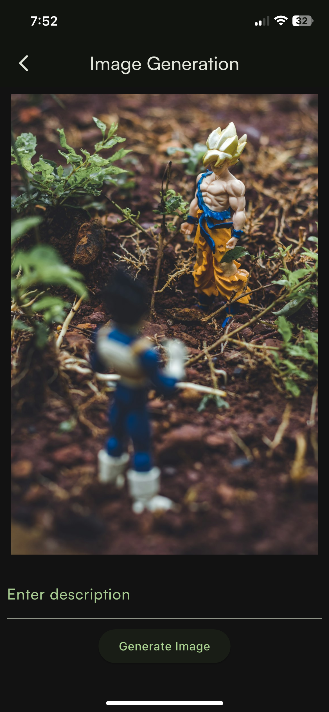

# AI Assistant App

**AI Assistant** is a mobile application, which includes Chat with Gemini, Image Generation, and Language Translation. Users can register and log in to access their personalized AI features, manage their data, and make the most out of the intelligent services provided by the app.

## Features
- **AI Chat with Gemini:** Engage in conversations with an AI assistant using Gemini integration.
- **AI Image Generation:** Generate AI-based images using the Unsplash API.
- **Language Translation:** Translate text between multiple languages such as English, Albanian, Slovenian, and German.
- **Chat Management:** Create new chats, view existing chat history, and delete unwanted chats.
- **Image Management:** View generated images, save them to your gallery, and delete them as required.
- **Translation History:** Access the history of translations and apply filters to view specific translations.
- **User Authentication:** Register and log in to personalize the experience.

## Technology Stack
- **Flutter**: Cross-platform mobile framework
- **Firebase Firestore**: For user authentication and data storage (chats, images, translations)
- **Google Generative AI (Gemini)**: For AI-based conversation functionality
- **Unsplash API**: For AI image generation


## Setup

1. **Setting Up Environment Variables:**
   The app requires certain API keys to interact with different services. You'll need to create an `.env` file in the root of the project and add the following keys:

    **Create a `.env` File**
    ```dotenv
    OPENAI_API_KEY=your_gemini_api_key_here
    UNSPLASH_ACCESS_KEY=your_unsplash_api_key_here
    ```

2. **Firebase Setup:**
   - Follow [Firebase Documentation](https://firebase.google.com/docs/flutter/setup) to add Firebase to your Flutter project.
   - Download `google-services.json` for Android and `GoogleService-Info.plist` for iOS and add them to the respective directories.
   - Enable Firestore and Authentication in your Firebase console.


## Using the Application

1. **User Authentication:**
   - Launch the app.
   - Register a new account or log in using existing credentials.

2. **Chat with AI (Gemini):**
   - From the home screen, tap on "Create New Chat".
   - Enter your prompt and get AI-based responses.

3. **Generate Images:**
   - Tap on "Image Generation".
   - Provide a prompt to generate an AI-based image.
   - You can save the generated image to your gallery by tapping the download button on the image details screen.

4. **Translate Languages:**
   - Tap on "Text Translation".
   - Select the languages to translate from and to.
   - Enter the text and view the translated output.
   - Access translation history, and filter it by language.

5. **Chat & Image Management:**
   - View your chat history and generated images in the side drawer.
   - Delete specific chats or images by tapping on the delete option.

## Project Structure
The project follows a clean architecture approach and is structured into three main layers:

1. **Data Layer:** Responsible for data-related tasks like accessing the APIs, Firebase Firestore, and mapping data models.
    - `/data/datasources/`
    - `/data/repositories/`

2. **Domain Layer:** Contains business logic, including use cases and entity definitions.
    - `/domain/usecases/`
    - `/domain/entities/`
    - `/domain/repositories/`

3. **Presentation Layer:** Deals with the UI and state management using Riverpod.
    - `/presentation/screens/`
    - `/presentation/notifiers/`
    - `/presentation/providers/`

## Firebase Firestore Integration
- **User Authentication**: Firebase Authentication is used for registering and logging in users securely.
- **Data Storage**: Firebase Firestore is used for storing chat history, generated images, and translation history, enabling easy access across multiple devices for a user.
- **Realtime Updates**: Firestore ensures that the app provides realtime updates for chat, translation history, and other personalized data.

## Screenshots

### Splash Screen


### Home Screen


### Image Generation


### Image Screen


### Text Translation


### History Screen


### Chat Screen


### Chat Message


## Contributing
Feel free to submit a pull request if you would like to contribute to this project.

## License
*Include the license under which the project is being released.*

## Contact
If you have any questions or issues regarding the app, feel free to reach out.


